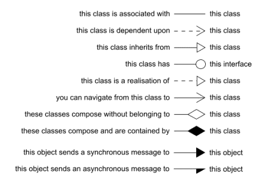
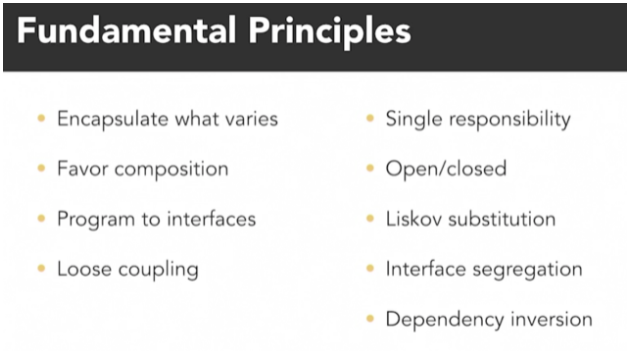

# oops_and_design_patterns

Java REF: http://people.eecs.berkeley.edu/~jrs/61b/ and https://ocw.mit.edu/courses/electrical-engineering-and-computer-science/6-092-introduction-to-programming-in-java-january-iap-2010/lecture-notes/

Object-Oriented programming lets you extend a program without having to touch previously-tested, working code.

THE LANGUAGE OF OBJECT-ORIENTED PROGRAMMING
===========================================
* Object: An object is a repository of data. For example, if MyList is a
 ShoppingList object, MyList might record your shopping list.
* Class: A class is a type of object. Many objects of the same class might exist; 
  for instance, MyList and YourList may both be ShoppingList objects. 
  A class is a template for creating objects. 
* Method: A procedure or function that operates on an object or a class.
 A method is associated with a particular class. For instance, addItem might
 be a method that adds an item to any ShoppingList object. Sometimes a method
 is associated with a family of classes. For instance, addItem might operate
 on any List, of which a ShoppingList is just one type.
* Inheritance: A class may inherit properties from a more general class. For
 example, the ShoppingList class inherits from the List class the property of
 storing a sequence of items.
* Polymorphism: The ability to have one method call work on several different
 classes of objects, even if those classes need different implementations of
 the method call. For example, one line of code might be able to call the
 "addItem" method on _every_ kind of List, even though adding an item to a
 ShoppingList is completely different from adding an item to a ShoppingCart.
* Object-Oriented: Each object knows its own class and which methods manipulate
 objects in that class. Each ShoppingList and each ShoppingCart knows which
 implementation of addItem applies to it.

In this list, the one thing that truly distinguishes object-oriented languages
from procedural languages (C, Fortran, Basic, Pascal) is polymorphism.

### The four pillars of object-oriented programming are:

* Abstraction
* Encapsulation
* Inheritance
* Polymorphism

#### Inheritance
Inheritance, the concept that we can reuse features or behaviors of a class by inheriting from it. 

You avoid duplicate code. You define a common protocol for a group of classes.

You get a lot of OO mileage by designing with inheritance. You can get rid of duplicate
code by abstracting out the behavior common to a group of classes, and sticking that code
in a superclass. That way, when you need to modify it, you have only one place to update

#### Encapsulation
Encapsulation, we can hide and protect the data in a class. 

Encapsulation is accomplished when each object maintains a private state, inside a class. Other objects can not access this state directly, instead, they can only invoke a list of public functions. The object manages its own state via these functions and no other class can alter it unless explicitly allowed. In order to communicate with the object, you will need to utilize the methods provided. 

#### Polymorphism
Polymorphism, the idea that we can write code that works for types, and their subtypes.

Polymorphism gives us a way to use a class exactly like its parent so there is no confusion with mixing types. This being said, each child sub-class keeps its own functions/methods as they are.

Polymorphism is derived from 2 Greek words: poly(many) and morphs(forms), so polymorphism means "many forms". A subclass can define its own unique behavior and still share the same functionalities or behavior of its parent/base class.

#### Abstraction
Abstraction, where we can hide away implementation details only relying on a class type or an interface.

Abstraction is an extension of encapsulation. It is the process of selecting data from a larger pool to show only the relevant details to the object. 

### UML diagrams notation

### Fundamental Priniciples

Encapsulate what varies: Identify the aspects of your application that vary and separate them from what stays the same. Letting one part of the system vary independently.
