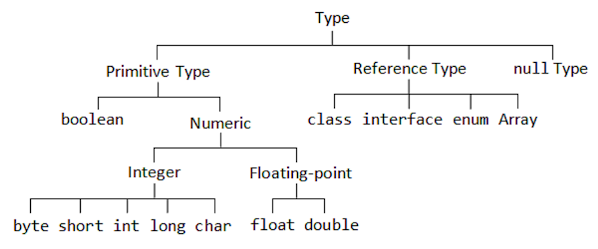

### Variables

* Variables come in two flavors: primitive and reference
* Variable must always be declared with a name and a type.
* A primitive variable value is the bits representing the value (5, ‘a’,true, etc)
* A reference variable value is the bits representing a way to get to an object on the heap.
* A reference variable is like a remote control, using the dot operator (.) on a reference variable is like pressing a button on the remote control to a access a method or instance variable.
* A reference variable has a value of null when it is not referencing any object.
* An array is always an object, even if the array is declared to hold primitives.

### Instance Variable Vs Local Variable.

Instance variable always gets a default value. these default values are

|    Data Type    | Default Value |
|:---------------:|:-------------:|
| integers        | 0             |
| floating points | 0.0           |
| booleans        | false         |
| references      | null          |

* Instance variables are declared inside a class but not within a method.
* Local variables are declared within a method
* Local variables must be initialized before use

### Equality of primitive or reference
* Two primitives can be compared using the `==` operator.
* When `==` is used for equality check of references it just tells if both reference point to the same Heap Address.
