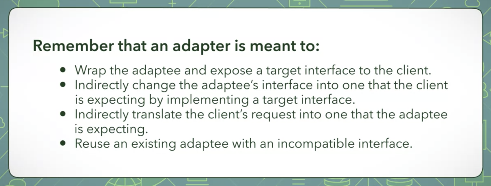
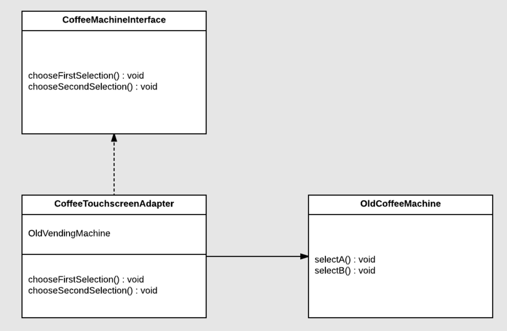

When to use?
* The client and the adaptee classes have incompatible interfaces
* The adapter translates the request sent by the client into a request that the adaptee class is expecting




Step1: Design the target interface. You create the target interface that your adapter class will be implementing for your client class to use. 

Step2: Implement the target interface with the adapter class

Step3: Send the request from the client to the adapter using the target interface.


## Example

You are working in an office with an old coffee machine that dispenses two different coffee flavours. However, the new boss wants to add a new coffee machine with a touchscreen that can also connect to the old coffee machine.



```java
CoffeeMachineInterface.java

public interface CoffeeMachineInterface {
    public void chooseFirstSelection();
    public void chooseSecondSelection();
}


OldCoffeeMachine.java

public class OldCoffeeMachine {

    public void selectA() {
        System.out.println(“A - Selected”);
    }
    
    Public void selectB() {
        System.out.println(“B - Selected”);
    }
}


CoffeeTouchscreenAdapter.java

public class CoffeeTouchscreenAdapter implements CoffeeMachineInterface {

    OldCofffeeMachine theMachine;

    public CoffeeTouchscreenAdapter(OldCoffeeMachine newMachine) {
        theMachine = newMachine;
    }

    public void chooseFirstSelection() {
        theMachine.selectA();
    }

    public void chooseSecondSelection() {
        theMachine.selectB();
    }
}
```
